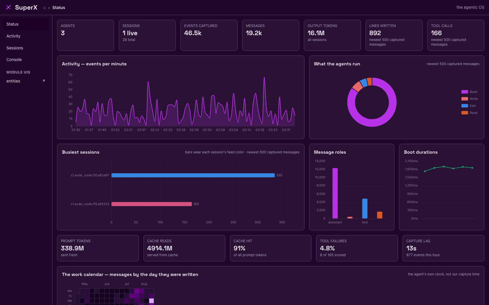
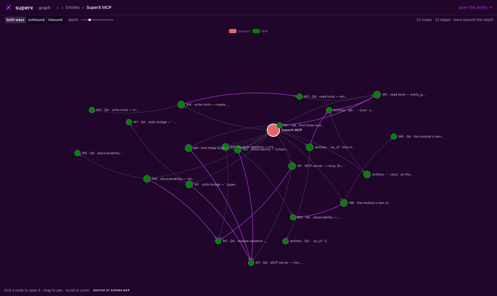
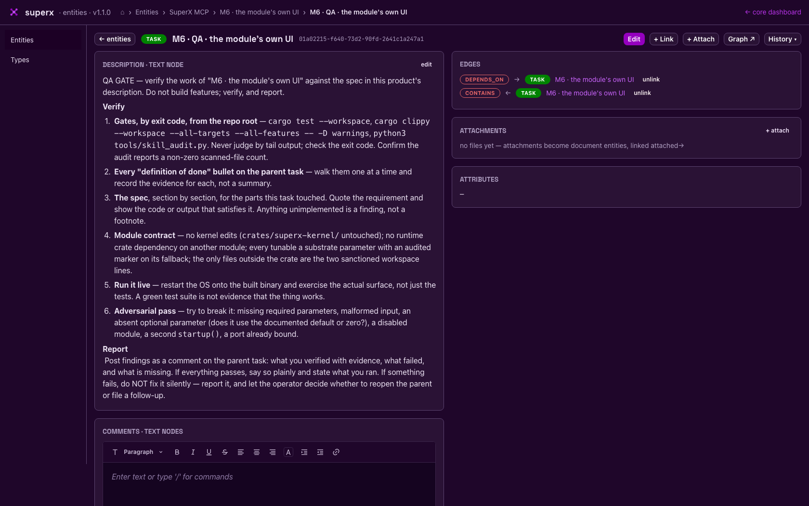
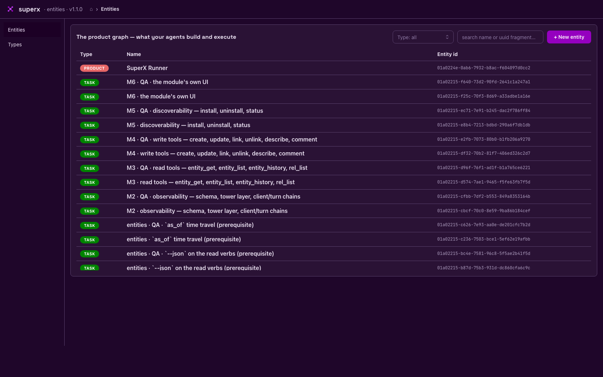

# SuperX

**The agentic OS.** Rust, on SurrealDB. Apache-2.0. [k8nstantin.github.io/superx](https://k8nstantin.github.io/superx/)

Your coding agents already run all day. SuperX captures every one of them — full conversations, tool calls, token usage, live and historical — then puts them to work: model the work as a graph, schedule it, dispatch agents against it in dependency order, and write the results back where the next agent will find them.

```
capture everything → model work as a graph → schedule the graph → agents execute → results land in the graph ↺
```

Every fact is an insert. Nothing is overwritten, so the history is evidence rather than a story.



---

## What it does

### 1. Captures every agent, with no agent-side setup

Per-agent adapters read the transcript files that Claude Code, Gemini CLI and Claude Desktop already write. Nothing is installed into their settings, no hooks, no wrapper binary — start the OS and history appears.

- **Backfill then tail.** Full history on first contact, then live from per-file byte-offset cursors, so a restart resumes exactly where it stopped.
- **Tolerant parsing.** Recognized lines become typed `message` rows with the raw JSON kept alongside; anything unrecognized still lands as telemetry rather than being dropped. An agent changing its format degrades capture, it does not stop it.
- **Sessions are `agent/uuid7`**, resolvable by any unique fragment, with token usage and context pressure read from the transcript rather than estimated.

```bash
superx agents                  # discovered agents, sessions, sources
superx sessions                # captured conversations, newest activity first
superx read <fragment> --live  # one conversation: history, then live
superx actions --live          # the action stream as it happens
```

### 2. Models the work as a graph

The entities module is the substrate a product or a role is designed in. Three tables, and one idea.

- **An entity is a uuid7.** Like a social security number: you can change your name and you are still you. So the row holds nothing that can change, and every edge and every label anchors to it — a rename cannot ripple through the graph, because the name was never in the graph.
- **Everything else is an attribute** — its name included. Any number, of five datatypes: `text`, `number`, `boolean`, `datetime`, `json`. Each has its own history, its own author and its own labels.
- **A label is an entity.** `role` is a row, and what `role` MEANS is an attribute on it. There is no label table and no type registry: a new label or a new kind of connection is data, never a migration.
- **An edge is an attribute the engine can walk** — a native relation, so following a deep graph costs a node's degree rather than a round trip per level.
- **Nothing here interprets anything.** The module enforces two things: a label must exist, and a value must be what its datatype says. What a role does, whether a mandate binds, which links are worth following — the reader's judgement. A test pins it: a label called `role` behaves exactly like one called `zzz`.



**The database is the interface.** There is no `superx entities` command: a person uses the dashboard, and another module reads the tables. A third surface saying the same things in a third shape is how the last one drifted.

Each entity carries its real ancestor path, and the module ships its own dashboard on its own port:



### 3. Runs it (being rebuilt)

The scheduler is being rebuilt. The previous one reached into the entities module's internals, which the module contract forbids — modules depend on the kernel, never on each other — and it has been removed rather than patched around.

What replaces it reads the substrate: an ordered list of entities in its own parameters, and a walk of each one's graph. Entities does not know it exists, and will not.

### 4. Everything above capture is a module

The kernel owns boot, capture, the telemetry stream, the substrate verbs and the module registry. Every other capability is a module that gets, by contract: its own database (`superx/<name>`) and service account, its own directory, log target, CLI namespace, substrate parameters, UUIDv7 identity, and optionally its own HTTP UI discovered from the substrate. Modules depend on the kernel and never on each other; several of a kind can coexist; they can be enabled and disabled on a running OS, and one failing to register does not stop the rest from booting.

| module | owns | CLI |
|---|---|---|
| `kernel` | substrate, boot, module registry | `superx status · logs` |
| `capture` | the capture loop over every discovered agent | `superx agents · sessions · read` |
| `ui` | the core dashboard — status, live feed, sessions, console | `superx ui url` |
| `entities` | entities, attributes, edges + its own dashboard | its own port; no CLI |
| `hello` | the contribution template | `superx hello greet` |



---

## The substrate

SurrealDB, insert-only, and the shape is the point:

- **A node is an immutable UUIDv7 anchor** plus an SCD-2 chain of state rows. "Current" is the newest row in the chain, computed at read time — never a mutated column, so an anchor stays a stable target for edges forever.
- **Edges are a native `TYPE RELATION … ENFORCED` table** written by `RELATE`. Unlinking appends a retraction row on the same edge chain instead of deleting one, so the link history survives.
- **The service account issues only `SELECT` and `CREATE`.** No verb in the codebase can `UPDATE` or `DELETE` — append-only is structural, not a convention someone has to remember.
- **UUIDv7 everywhere**, so ids are time-ordered and the substrate is its own historical log.
- **Nine kernel tables:** `type_definition`, `cursor_type`, `entity`, `relation`, `state_ledger`, `cursor`, `telemetry_stream`, `message`, `module`. The kernel schema is locked and CI-gated; modules bring their own.

Upgrades are `git pull`, `cargo build`, `superx restart` — the schema self-upgrades on version mismatch.

## The code

| crate | lines | what it is |
|---|---:|---|
| `superx-kernel` | 7.5k | substrate verbs, boot, capture engine, adapters, telemetry, module registry |
| `superx-mod-entities` | 1.5k | entities, attributes and edges, its HTTP API and its own React dashboard |
| `superx-mod-ui` | 3.1k | the core dashboard: typed API, SSE, four pages |
| `superx` | 1.6k | the CLI and the initialize/lifecycle flow |
| `superx-ops` | 0.7k | shared runners and renderers |
| `superx-mod-hello` | 0.2k | the module template |

176 tests, all on an in-memory engine, no fixtures to maintain.

## Contributing

The most useful thing to add is **an agent adapter** — one trait with two methods, `discover` and `poll`. Cursor, Codex, Copilot and Windsurf are unclaimed, and each one widens what the OS can see; `crates/superx-kernel/src/adapters/claude_code.rs` is the reference.

After that, **a module**: the contract is documented end to end in [`docs/MODULES.md`](docs/MODULES.md) and `superx-mod-hello` exists to be copied. If you have wanted a capability on top of captured agent history — search, cost analysis, a different dashboard, an export — it is a crate with a descriptor, not a fork.

Workflow: an issue defines the work, one short-lived branch per issue, a PR whose body opens with `Closes #N`, and three green gates. Questions that are not bug reports belong in [Discussions](../../discussions).

## Instance layout

```
<home>/                     # --home flag / SUPERX_HOME env, default "."
  params/superx.json        # THE parameter file — all bootstrap config
  logs/superx.log.<date>    # kernel self-log     (superx logs)
  logs/superx-daemon.log    # background OS output (superx logs --daemon)
  logs/surreal-server.log   # database server output
  db/superx-v2.db/          # datastore (rocksdb)
  db/superx-credentials     # service password, 0600
  db/superx.pid             # background OS pid
```

## Quick start / QA protocol

```bash
# ONE command: prompts for a password, provisions everything, boots
# the OS in the background, and RETURNS YOUR TERMINAL.
superx --initialize

# Confirm data is being gathered (no exports needed — credentials are
# read from the instance):
superx status                  # OS: running (pid N) + module lifecycle
superx agents                  # discovered agents + agent_ids + counts
superx sessions | head         # captured conversations
superx actions --live          # watch agents act, as it happens
superx read <fragment> --live  # read a conversation, history then live
superx logs -n 40              # the OS's own log (--follow to tail)

# Lifecycle:
superx stop                    # graceful shutdown (lands in seconds,
                               # even mid-backfill)
superx start                   # boot back (already-initialized instance)
superx restart                 # stop + start — one command to pick up
                               # a freshly built binary
```

After upgrading the binary, `superx restart` moves the background OS
to the new build. Live viewers (`actions --live`, `read --live`)
render client-side — re-run them after an upgrade to pick up renderer
changes.

The first minutes after a fresh initialize are history backfill (your
full Claude Code history; Gemini chat files capped at 8 MiB each,
announced via `backfill_capped` events). Claude Desktop shows zero
sessions by design — its conversations are cloud-side; its telemetry
is captured. `superx boot` (foreground) remains for debugging and
refuses while the background OS runs.

## Manual provisioning (alternative to `--initialize`)

```bash
# 1. Start a SurrealDB server on a FRESH v2 path
export SUPERX_ROOT_PASSWORD='<root password>'
surreal start --user root --pass "$SUPERX_ROOT_PASSWORD" rocksdb:./db/superx-v2.db &

# 2. Apply the kernel schema once, under root
export SUPERX_KERNEL_PASSWORD='<kernel service-account password>'
./scripts/deploy-schema.sh
```

Either way the schema is locked from first apply (skill §7) and all
kernel runtime code signs in as the `superx_kernel` service account —
never root (`--initialize` uses the root password once, in-process,
and never stores it).

## Development gates (binding)

```bash
cargo test --workspace
cargo clippy --workspace --all-targets --all-features -- -D warnings
python3 tools/skill_audit.py
```

Contributors using LLM-assisted development operate under
[`.claude/skills/zero-trust-execution/SKILL.md`](.claude/skills/zero-trust-execution/SKILL.md).

## License

[Apache License 2.0](LICENSE). See [`NOTICE`](NOTICE) for attribution.
